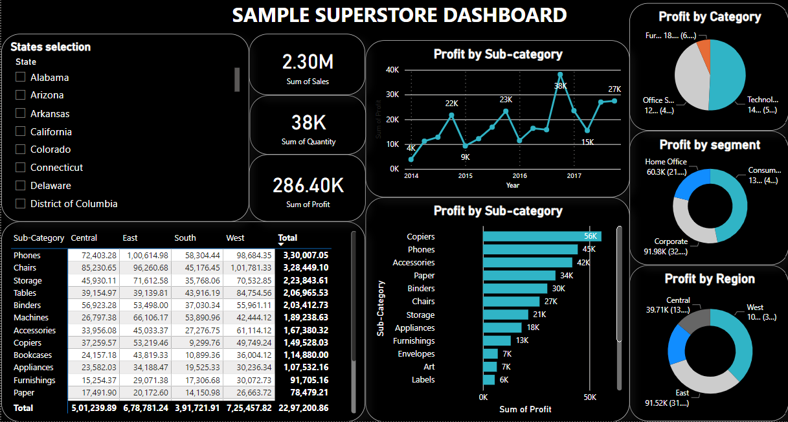

# PowerBI Interactive Dashboard for Sample Store Data Analysis

## Overview

This repository presents an intricately crafted interactive dashboard developed with PowerBI to represent the Sample Store data. The project rigorously analyzes trends and patterns within the dataset, leveraging PowerBI's advanced features for interactive charting and graphing. The primary goal is to augment data comprehension and enable the seamless communication of insights. The resultant comprehensive dashboard offers a visually engaging representation of key findings, empowering users to extract meaningful conclusions from the Sample Store data.

## Dataset

- The dataset contains 21 variables, including Row ID, Order ID, Order Date, Ship Date, Ship Mode, Customer ID, Customer Name, Segment, Country, City, State, Postal Code, Region, Product ID, Category, Sub-Category, Product Name, Sales, Quantity, Discount, and Profit.
- The dataset spans from 2014 to 2017, encompassing sales details across all U.S. states.
- All monetary values are in US($) currency.
- Three distinct customer segments: Home Office, Consumer, and Corporate.
- Products are categorized into Furniture, Office Supplies, and Technology.
- Four regional classifications for U.S. states: Central, South, East, and West.
- There are 17 items accounting for sub-categories.

## Dashboard

Information obtained from the dashboard:

- All visualizations are customized, allowing analysis based on U.S. states.
- Sum of Sales, Sum of Quantity, Sum of Profit.
- Profit breakdown by Category, Segment, and Region.
- Sub-Category profit analyzed across the years from 2014 to 2017.
- Profit by Sub-Category based on the sum of profit.
- Table illustrating total sales by sub-category and region.

 Results from Dashboard

- Total sales amount is 2.30M, with 38K units sold and a Total profit made is 286.40K.
- Highest sub-category profits observed from 2016 to 2017, peaking around October to November.
- Copiers emerge as the most profitable sub-category.
- Technology category leads with 50.76% of the total profit, followed by Consumer.
- Consumer segment dominates with 46.83% of the total profit.
- Western region states exhibit the highest profit, closely trailed by Eastern region states, South, and Central regions.

## Conclusion

The PowerBI dashboard offers a comprehensive analysis of sales data, providing valuable insights for strategic decision-making. The dataset, spanning 2014 to 2017, encompasses diverse U.S. states, allowing for tailored visualizations based on geographic regions. Key highlights include peak sub-category profits observed in the latter years, with Copiers emerging as a standout category. Technology products significantly contribute to the overall profit share, particularly in the Western region. The dominance of Consumer segment profits and regional variations underscores the importance of targeted strategies. The interactive and customizable nature of the dashboard enhances its utility for extracting actionable business intelligence.
